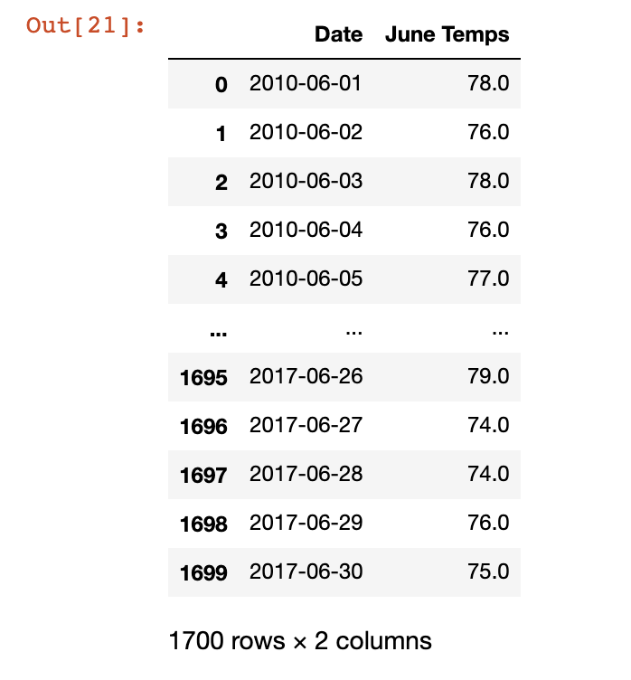
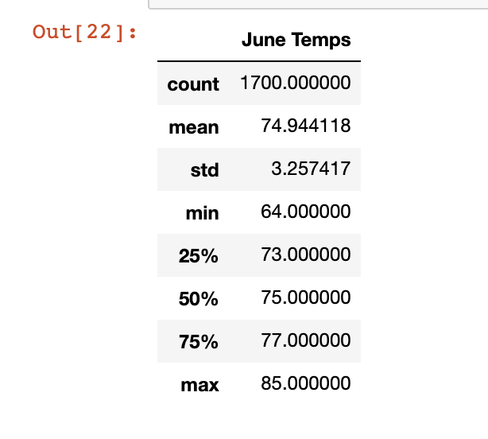
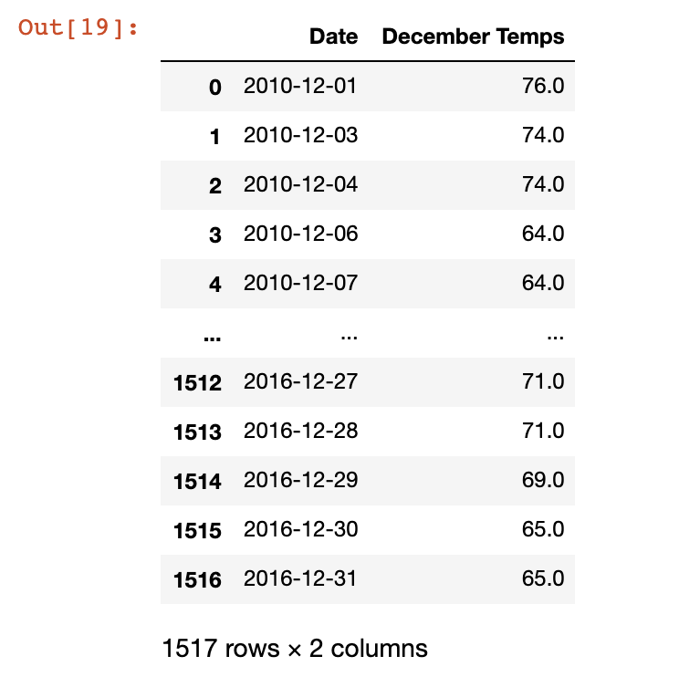
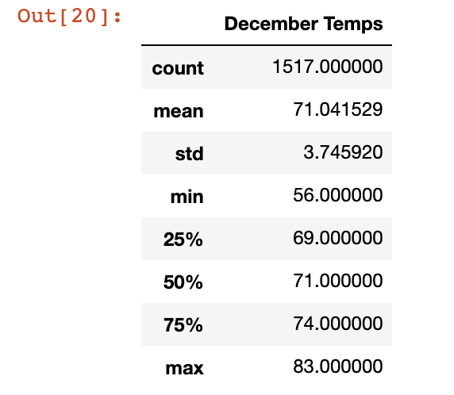

# Surfs Up

## Overview of the Statistical Analysis
In this Surf's Up challenge, our objective was find temperature, achieved through the use of performing a weather analysis. W.Avy's wanted us to provide this information in efforts of finding trends in temperature data prior to opening a surf shop. This project intended on helping predict the overall sustainability of the surf and ice cream shop throughout the entire year.

## Results
When running our weather analysis, we focused on June and December, which were the months W.Avy wanted us to analyze. 

Our results for June were as followed:

Our results for December were as followed:

At first glance, we note that the max weather in June is 85 versus the max of 83 in December. This is a difference of 2 degrees, which is not a stark change in the months. In the same light, we may note that the mean in June was 74.944 degrees and in December, 71.04. Therefore, we can infer that there is on an average only near a 3 degree difference between these months. 

In contrast to the highest temperatures, the lowest temperature in December is 56, versus 64 in June. This is a slightly greater gap than our past two observations, since it means that there is an 8 degree difference between the lowest temperatures of these two months.

## Summary
In conclusion, it is a safe bet to advise W.Avy that running a surf and ice cream shop could be a sustainable business venture to pursue. There are no forseeable consequences to doing so based on our results and data. 
